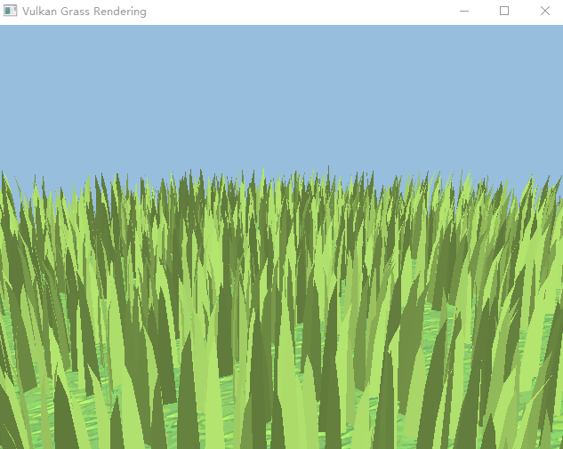

Vulkan Grass Rendering
========================

A implementation of  [Responsive Real-Time Grass Rendering for General 3D Scenes](https://www.cg.tuwien.ac.at/research/publications/2017/JAHRMANN-2017-RRTG/JAHRMANN-2017-RRTG-draft.pdf).

## Features

- Simulating forces
  -  gravity
  -  recovery
  -  wind
- Culling
  -  orientation
  -  frustum
  -  distance

## Credit

* https://2minutetabletop.com/product/tiling-grass-textures/ The texture of the ground
